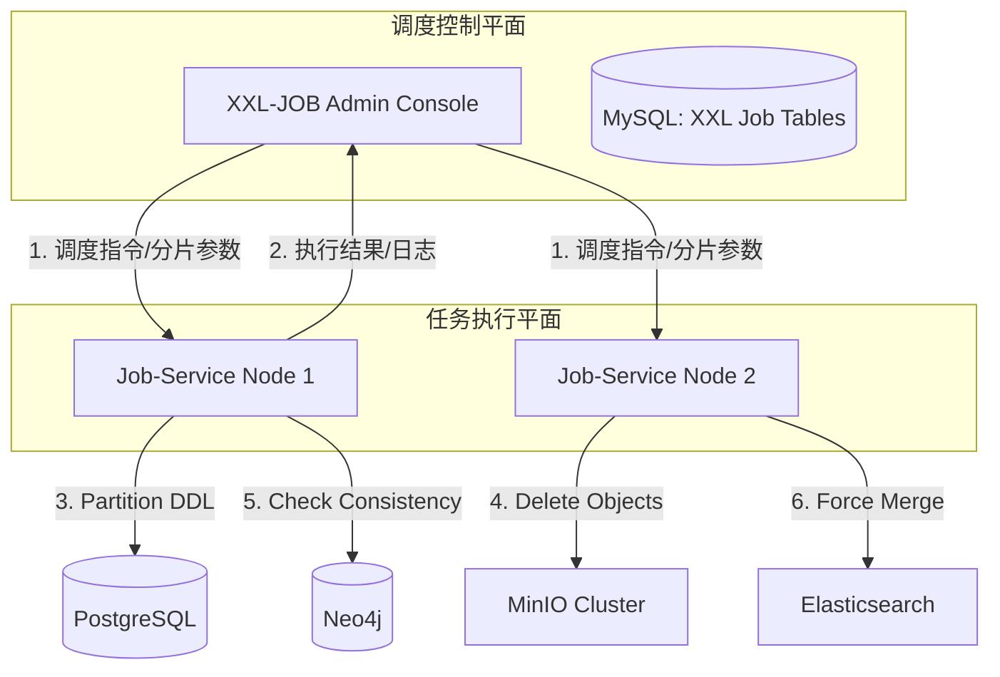

这是 `job-service`** (分布式调度与批处理服务)** 的详细架构设计。

在企业级微服务架构中，`job-service` 扮演着**“守夜人”**和**“清道夫”**的角色。它负责执行那些耗时、周期性、需要大量计算资源或维护系统健康的任务。

---

### 1. 核心定位与技术选型
+ **核心定位**：
    - **分布式调度器**：统一管理全系统的定时任务，提供可视化的任务编排、日志监控和手动触发能力。
    - **数据维护中心**：负责数据库分区管理、冷热数据迁移、索引维护。
    - **资源回收站**：负责 MinIO 孤儿文件清理、过期日志归档。
    - **报表引擎**：每日凌晨计算 T+1 的业务报表（活跃度、消息量等）。
+ **技术栈**：
    - **调度框架**: **XXL-JOB** (Java 领域事实标准，支持分片广播、失败重试、动态传参)。
    - **批处理框架**: **Spring Batch** (可选，用于超大数据量的 Chunk 处理)。
    - **Runtime**: Spring Boot 3.x。
    - **执行方式**: 通过 `XxlJob` 注解定义任务 Handler。

---

### 2. 架构拓扑图
`job-service` 分为 **调度中心 (Admin)** 和 **执行器 (Executor)** 两部分。



---

### 3. 核心任务设计 (Core Jobs)
我们将任务分为三类：**运维类、业务类、数据类**。

#### 3.1 运维类任务 (Ops Jobs)
| 任务名称 | 频率 | 描述 | 关键逻辑 |
| :--- | :--- | :--- | :--- |
| **PG分区自动创建** | 每日 02:00 | 检查下个月的分区表是否存在，不存在则创建 | 针对 `chat_messages`, `chat_inbox` 表。避免月初第一天服务挂掉。 |
| **ES索引维护** | 每日 03:00 | 对 7 天前的索引执行 `Force Merge` | 减少 Segment 数量，释放磁盘空间，提升查询性能。 |
| **MinIO垃圾回收** | 每日 04:00 | 物理删除 `ref_count=0` 的文件 | 扫描 `file_metadata` 表 `status=2` 的记录，调用 MinIO SDK 删除，再删 DB。 |
| **Token黑名单清理** | 每小时 | 清理 Redis 中过期的 JWT 黑名单 | 移除 `auth:block:token:*` 中 TTL < 0 的 Key（Redis 自身会删，但此任务用于兜底统计）。 |


#### 3.2 数据一致性任务 (Consistency Jobs)
| 任务名称 | 频率 | 描述 | 关键逻辑 |
| :--- | :--- | :--- | :--- |
| **图数据库对账** | 每日 05:00 | 检查 Postgres 和 Neo4j 的数据偏差 | 统计 PG `users` 总数 vs Neo4j `User` 节点总数。若偏差 > 0.1%，发送告警邮件。 |
| **消息回查兜底** | 每 10 分钟 | 修复 RocketMQ 事务消息可能的漏单 | (通常 RocketMQ 自身机制足够，此为深度防御) 扫描 `chat_messages` 检查是否有断号。 |


#### 3.3 业务报表任务 (Business Jobs)
| 任务名称 | 频率 | 描述 | 关键逻辑 |
| :--- | :--- | :--- | :--- |
| **每日统计报表** | 每日 01:00 | 计算昨日 DAU、消息总量、新增用户 | 聚合查询 `audit_logs` 和 `chat_messages`，写入 `daily_stats` 表。 |
| **群活跃度计算** | 每周一 02:00 | 计算群组活跃度分数 | 基于消息量、互动量计算 Score，用于“热门群组”推荐。 |


---

### 4. 关键任务详细设计与代码
#### 4.1 PostgreSQL 分区自动维护 (`PartitionJob`)
这是最关键的任务，一旦失败会导致月初服务不可用。

+ **策略**：**预创建 (Pre-create)**。每月 15 号检查下个月的分区表。
+ **分片策略**：单机执行 (无分片)。

```java
@Component
public class PartitionJob {

    @Autowired
    private JdbcTemplate jdbcTemplate;

    @XxlJob("pgPartitionHandler")
    public void createPartitions() {
        LocalDate nextMonth = LocalDate.now().plusMonths(1);
        String suffix = nextMonth.format(DateTimeFormatter.ofPattern("yyyy_MM"));
        
        // 1. 维护 chat_messages 分区
        createTableIfNotExists("chat_messages", suffix, nextMonth);
        
        // 2. 维护 chat_inbox 分区
        createTableIfNotExists("chat_inbox", suffix, nextMonth);
    }

    private void createTableIfNotExists(String baseTable, String suffix, LocalDate date) {
        String tableName = baseTable + "_" + suffix;
        String start = date.withDayOfMonth(1).toString(); // 2025-12-01
        String end = date.plusMonths(1).withDayOfMonth(1).toString(); // 2026-01-01
        
        String sql = String.format(
            "CREATE TABLE IF NOT EXISTS %s PARTITION OF %s FOR VALUES FROM ('%s') TO ('%s')",
            tableName, baseTable, start, end
        );
        
        try {
            jdbcTemplate.execute(sql);
            XxlJobHelper.log("Created partition: " + tableName);
        } catch (Exception e) {
            XxlJobHelper.log("Failed to create partition: " + e.getMessage());
            XxlJobHelper.handleFail();
        }
    }
}
```

#### 4.2 MinIO 垃圾回收 (`FileGcJob`)
此任务可能涉及数百万条数据，必须使用 **分片广播 (Sharding Broadcast)** 并行处理。

+ **策略**：
    - XXL-JOB 发起调度，指定 3 个执行器节点。
    - 每个节点只处理 `id % 3 == shardIndex` 的数据。

```java
@Component
public class FileGcJob {

    @Autowired
    private FileMetadataMapper fileMapper;
    @Autowired
    private MinioClient minioClient;

    @XxlJob("fileGcHandler")
    public void fileGc() {
        // 1. 获取分片参数
        int shardIndex = XxlJobHelper.getShardIndex();
        int shardTotal = XxlJobHelper.getShardTotal();
        
        // 2. 分页拉取待删除文件 (Status=2 AND UpdateTime < 24h ago)
        // SQL: SELECT * FROM file_metadata WHERE status=2 AND MOD(id, #{total}) = #{index} LIMIT 1000
        long lastId = 0L;
        while (true) {
            List<FileMetadata> files = fileMapper.selectWaitGcFiles(shardTotal, shardIndex, lastId);
            if (files.isEmpty()) break;

            for (FileMetadata file : files) {
                try {
                    // 3. 物理删除 MinIO 对象
                    minioClient.removeObject(RemoveObjectArgs.builder()
                        .bucket(file.getBucket())
                        .object(file.getPath())
                        .build());
                    
                    // 4. 硬删除 DB 记录
                    fileMapper.deleteById(file.getFileHash());
                    
                } catch (Exception e) {
                    XxlJobHelper.log("GC Failed: " + file.getFileHash());
                }
                lastId = file.getId(); // 游标滚动
            }
        }
    }
}
```

#### 4.3 数据一致性对账 (`ConsistencyCheckJob`)
```java
@Component
public class ConsistencyJob {

    @Autowired
    private UserMapper userMapper;
    @Autowired
    private Driver neo4jDriver; // Neo4j

    @XxlJob("userConsistencyHandler")
    public void checkUserCount() {
        // 1. 查 PG 总数
        Long pgCount = userMapper.selectCount(null);
        
        // 2. 查 Neo4j 总数
        Long neo4jCount;
        try (Session session = neo4jDriver.session()) {
             neo4jCount = session.run("MATCH (n:User) RETURN count(n)").single().get(0).asLong();
        }

        // 3. 比对
        XxlJobHelper.log("PG: " + pgCount + ", Neo4j: " + neo4jCount);
        
        if (Math.abs(pgCount - neo4jCount) > 0) {
            // 发送告警
            sendAlert("Data inconsistency detected! PG vs Neo4j");
            XxlJobHelper.handleFail("Inconsistency detected");
        } else {
            XxlJobHelper.handleSuccess();
        }
    }
}
```

---

### 5. 统计报表数据库设计
`job-service` 计算的结果通常存储在独立的统计表中，供 `admin-service` 查询展示。

```sql
-- 每日统计表
CREATE TABLE daily_stats (
    id BIGSERIAL PRIMARY KEY,
    stat_date DATE NOT NULL,          -- 统计日期 (2025-11-24)
    
    total_users BIGINT DEFAULT 0,     -- 总用户数
    active_users BIGINT DEFAULT 0,    -- DAU
    
    total_msgs BIGINT DEFAULT 0,      -- 当日消息总数
    storage_usage BIGINT DEFAULT 0,   -- MinIO 存储增量 (Bytes)
    
    api_qps_peak INT DEFAULT 0,       -- API QPS 峰值
    
    created_at TIMESTAMPTZ DEFAULT NOW(),
    UNIQUE(stat_date)
);

-- 群组活跃度排行 (Top 100)
CREATE TABLE group_activity_rank (
    id BIGSERIAL PRIMARY KEY,
    stat_week VARCHAR(10),            -- "2025-48" (第48周)
    channel_id BIGINT NOT NULL,
    msg_count BIGINT,                 -- 发言数
    active_members INT,               -- 发言人数
    score DECIMAL(10, 2),             -- 综合热度分
    rank INT,                         -- 排名
    created_at TIMESTAMPTZ DEFAULT NOW()
);
```

---

### 6. 部署与运维
+ **部署方式**:
    - **XXL-JOB Admin**: 独立部署一个 Jar 包，依赖 MySQL。
    - **Job-Service**: 作为微服务部署，建议至少 2 个节点以保证高可用。
+ **配置**:
    - `xxl.job.admin.addresses`: 指向 Admin 地址。
    - `xxl.job.executor.appname`: 设置为 `job-service`。
+ **容错**:
    - 任务需保证**幂等性**（Idempotency）。例如 `PartitionJob` 中的 SQL 使用 `IF NOT EXISTS`。
    - 利用 XXL-JOB 的“失败重试”机制（Retry Count = 3）。

### 7. 总结
`job-service` 是系统的**自动化运维中心**。  
它不需要复杂的业务逻辑，但需要极高的**健壮性**。通过将定期维护任务代码化、可视化，你避免了手动执行脚本的风险，并为系统的长期稳定运行提供了保障。特别是**Postgres 分区自动维护**和**MinIO GC**，是这个服务存在的最大价值。

