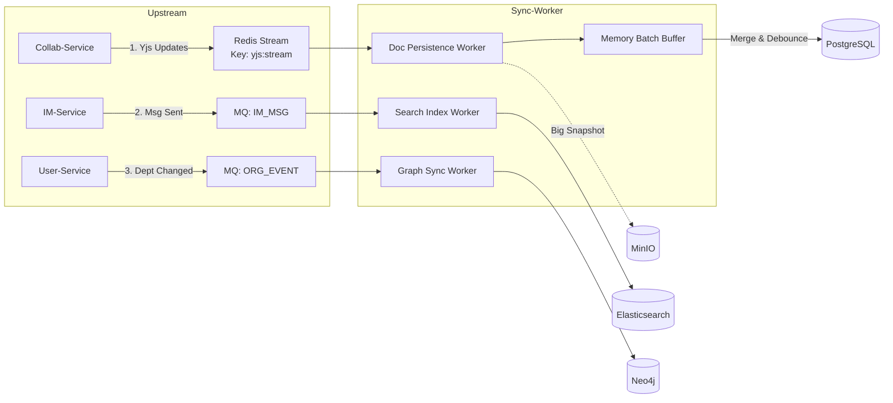

在整个微服务体系中，`sync-worker` 是一个**“幕后英雄”**。它不直接面向用户请求，而是默默地在后台处理高吞吐的数据流，负责将**Redis 内存数据落地**、**异构数据库（PG/Neo4j/ES）之间的数据同步**以及**资源清理**。

---

### 1. 核心定位与设计哲学
+ **核心职责**：
    - **清洗工 (Cleaner)**：将 `collab-service` 产生的高频 Yjs 更新流清洗、合并后持久化到 PostgreSQL/MinIO。
    - **翻译官 (Translator)**：将业务事件（如“移动部门”）翻译成图数据库（Neo4j）的 Cypher 语句。
    - **搬运工 (Carrier)**：将 IM 消息搬运到 Elasticsearch 用于全文检索。
+ **设计模式**：**EDA (Event-Driven Architecture)** + **Batch Processing (批处理)**。
+ **关键指标**：高吞吐（Throughput）、最终一致性（Eventual Consistency）。

---

### 2. 技术栈清单
+ **Runtime**: Java 21 (Spring Boot 3.x) - 利用 Virtual Threads 处理大量 IO 任务。
+ **Input Sources**:
    - **Redis Stream**: 用于接收文档的高频更新 (Consumer Group 模式)。
    - **RocketMQ**: 用于接收业务低频但重要的变更事件。
+ **Output Sinks**:
    - **PostgreSQL**: 持久化文档快照。
    - **Neo4j**: 同步组织架构图谱。
    - **Elasticsearch**: 写入搜索索引。
    - **MinIO**: 存储大体积的文档快照。
+ **Libs**: `lettuce` (Redis), `neo4j-java-driver`, `elasticsearch-java`.

---

### 3. 架构数据流图 (Data Flow)


---

### 4. 核心模块详细设计
#### 4.1 文档持久化管道 (Document Persistence Pipeline)
这是最复杂的模块。前端协同产生的 Update 是毫秒级的，直接写 DB 会挂，必须经过**“缓冲-合并-落库”**三部曲。

+ **输入**: Redis Stream `yjs:stream`
    - Entry: `{ "doc_id": "1001", "update": <Base64Bytes>, "ts": 171000... }`
+ **处理策略**: **Micro-Batch (微批处理)**
    1. **拉取**: 消费者组每次拉取 100 条消息 (`XREADGROUP COUNT 100`)。
    2. **分组**: 在内存中按 `doc_id` 分组。
    3. **合并**: 将同一个 `doc_id` 的多个 `update` 二进制数据合并成一个大的 `update`（简单的字节拼接即可，Yjs 支持直接拼接 Updates）。
    4. **落库 (Upsert)**:
        * 从 DB 读取旧的 `snapshot_binary`。
        * 执行 Yjs 的 `applyUpdate(snapshot, new_merged_update)`。
        * **大小检查**:
            + 如果结果 < 1MB: 更新 `documents` 表的 `snapshot_binary` 字段。
            + 如果结果 > 1MB: 上传 MinIO，更新 `documents` 表存 MinIO URL，并清空 DB 中的 binary 字段。
    5. **ACK**: 向 Redis Stream 发送 `XACK`。

#### 4.2 图数据库同步器 (Graph Syncer)
负责维护 Postgres 和 Neo4j 的一致性。

+ **输入**: RocketMQ `ORG_EVENT`, `USER_EVENT`
+ **消费模式**: **Orderly (顺序消费)**。必须保证同一个部门的“创建”在“移动”之前执行。
+ **事件映射逻辑**:
    - `USER_CREATED`:

```cypher
MERGE (u:User {id: $uid}) SET u.name = $name
```

    - `DEPT_CREATED`:

```cypher
MERGE (d:Dept {id: $deptId}) 
MERGE (p:Dept {id: $parentId})
MERGE (d)-[:SUB_DEPT_OF]->(p)
```

    - `DEPT_MOVED` (核心):

```cypher
MATCH (d:Dept {id: $deptId})
MATCH (d)-[r:SUB_DEPT_OF]->() DELETE r
WITH d
MATCH (newP:Dept {id: $newParentId})
MERGE (d)-[:SUB_DEPT_OF]->(newP)
```

    - `PERM_GRANT` (授权):

```cypher
MATCH (u:User {id: $uid}), (doc:Resource {id: $docId})
MERGE (u)-[:CAN_EDIT]->(doc)
```

#### 4.3 搜索索引构建器 (Search Indexer)
负责 IM 消息和文档内容的全文检索入库。

+ **输入**: RocketMQ `IM_MSG_SEND` (Timeline落库成功后发送)
+ **处理逻辑**:
    1. **解析**: 提取文本内容。如果是富文本/JSON，提取纯文本字段。
    2. **分词**: 利用 ES 的 IK 分词器。
    3. **批量写入**: 使用 Elasticsearch `Bulk API`，每 500 条或每 1 秒提交一次。
    4. **索引结构**:

```json
{
  "msg_id": 12345,
  "channel_id": 888,
  "content": "项目进度汇报...",
  "sender_id": 1001,
  "created_at": 1710001234
}
```

---

### 5. 关键代码实现 (Java)
#### 5.1 Redis Stream 消费者 (DocPersistenceWorker)
```java
@Component
public class DocPersistenceWorker implements ApplicationRunner {

    @Autowired
    private RedisTemplate<String, String> redisTemplate;
    @Autowired
    private DocumentMapper docMapper;
    @Autowired
    private MinioClient minioClient;

    @Override
    public void run(ApplicationArguments args) {
        // 启动独立线程进行消费
        new Thread(this::consumeLoop).start();
    }

    private void consumeLoop() {
        StreamOffset<String> offset = StreamOffset.create("yjs:stream", ReadOffset.lastConsumed());
        while (true) {
            try {
                // 1. 拉取消息 (Block 2秒)
                List<MapRecord<String, Object, Object>> records = redisTemplate.opsForStream()
                        .read(Consumer.from("sync-group", "worker-1"), offset);

                if (records == null || records.isEmpty()) continue;

                // 2. 内存分组合并
                Map<Long, byte[]> batchUpdates = new HashMap<>();
                for (MapRecord record : records) {
                    Long docId = Long.parseLong((String) record.getValue().get("docId"));
                    String updateBase64 = (String) record.getValue().get("update");
                    byte[] update = Base64.getDecoder().decode(updateBase64);
                    
                    batchUpdates.merge(docId, update, (oldB, newB) -> {
                        // 简单的字节拼接，Yjs 支持这种合并
                        return Bytes.concat(oldB, newB); 
                    });
                }

                // 3. 批量落库
                batchUpdates.forEach(this::persistDoc);

                // 4. ACK
                String[] recordIds = records.stream().map(MapRecord::getId).toArray(String[]::new);
                redisTemplate.opsForStream().acknowledge("yjs:stream", "sync-group", recordIds);

            } catch (Exception e) {
                log.error("Sync error", e);
                // 简单的错误休眠，防止死循环日志爆炸
                Thread.sleep(1000); 
            }
        }
    }

    private void persistDoc(Long docId, byte[] newUpdates) {
        // 查库 -> 合并 -> 更新 (乐观锁控制版本)
        // 此处逻辑需精细处理：
        // 1. SELECT snapshot_binary FROM documents WHERE doc_id = ?
        // 2. merged = Bytes.concat(snapshot_binary, newUpdates)
        // 3. UPDATE documents SET snapshot_binary = merged WHERE doc_id = ?
        // 4. 如果 snapshot 太大，转存 MinIO
    }
}
```

#### 5.2 RocketMQ 图同步监听器 (GraphSyncListener)
```java
@Component
@RocketMQMessageListener(
    topic = "ORG_EVENT", 
    consumerGroup = "graph-sync-group",
    consumeMode = ConsumeMode.ORDERLY // 顺序消费
)
public class GraphSyncListener implements RocketMQListener<OrgEvent> {

    @Autowired
    private Driver neo4jDriver; // Neo4j Driver

    @Override
    public void onMessage(OrgEvent event) {
        try (Session session = neo4jDriver.session()) {
            switch (event.getType()) {
                case "DEPT_MOVED":
                    String cypher = "MATCH (d:Dept {id: $id}) " +
                                    "MATCH (d)-[r:SUB_DEPT_OF]->() DELETE r " +
                                    "WITH d " +
                                    "MATCH (newP:Dept {id: $newPid}) " +
                                    "MERGE (d)-[:SUB_DEPT_OF]->(newP)";
                    session.run(cypher, parameters("id", event.getId(), "newPid", event.getNewParentId()));
                    break;
                // 处理 USER_CREATED, MEMBER_ADDED 等...
            }
        } catch (Exception e) {
            // 抛出异常，RocketMQ 会重试
            throw new RuntimeException("Sync Neo4j failed", e);
        }
    }
}
```

---

### 6. 异常处理与重试机制 (Resiliency)
+ **Redis Stream 积压**:
    - 监控 `XPENDING` 数量。如果积压过多，动态增加 `sync-worker` 的 Pod 数量（自动伸缩）。
+ **数据库死锁**:
    - 在更新 `documents` 时使用乐观锁 (`version` 字段)。如果 update 失败（返回 0 行），重新读取最新 snapshot 再合并重试。
+ **Neo4j 同步失败**:
    - RocketMQ 默认重试 16 次。如果依然失败，进入 **Dead Letter Queue (DLQ)**。
    - **补偿机制**: 编写一个定时任务 `ConsistencyChecker`，每天凌晨对比 Postgres 和 Neo4j 的节点数量，发现不一致则全量修复。

### 7. 数据归档与清理 (Archiving)
`sync-worker` 还负责“扫地”工作。

+ **定时任务**: 每天凌晨 3 点。
+ **MinIO 清理**: 扫描 Postgres `file_metadata` 表，查找 `ref_count = 0` 且 `status = 2 (GC_PENDING)` 的记录，调用 MinIO SDK 删除实际文件。
+ **消息归档**: 检查 `chat_messages` 表，将超过 365 天的分区表数据导出到冷存储（如 AWS S3 Glacier），然后 `DROP PARTITION`。

### 总结
`sync-worker` 是系统的稳定器。它通过**异步解耦**，让前端（Node.js）和业务端（IM-Service）只需关注“快”，而将“重”和“慢”的落库、索引、同步逻辑全部揽下。这种设计保证了系统在高并发下的健壮性。

